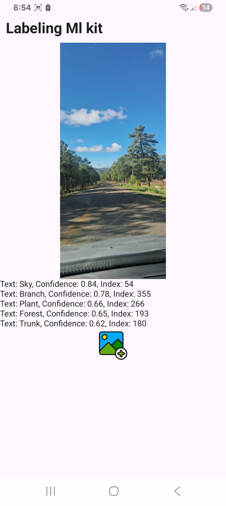

# Procesamiento de Imágenes con ML Kit

Este módulo se encarga de permitir que el usuario seleccione una imagen desde la galería, y posteriormente se analice con el etiquetador de imágenes de Google ML Kit para obtener descripciones automáticas del contenido visual.

---

## 1. Selección de Imagen

La interfaz permite al usuario elegir una imagen de su galería mediante `ActivityResultContracts.PickVisualMedia`.

```kotlin
val pickMedia =
    rememberLauncherForActivityResult(ActivityResultContracts.PickVisualMedia()) { uri ->
        if (uri != null) {
            context.contentResolver.takePersistableUriPermission(
                uri,
                Intent.FLAG_GRANT_READ_URI_PERMISSION
            )
            onSelectImage(uri)
        }
    }

pickMedia.launch(PickVisualMediaRequest(ActivityResultContracts.PickVisualMedia.ImageOnly))
```
 **Captura del flujo de selección de imagen**  
<p align="center">
  
</p>


---

## 2. Procesamiento con ML Kit

Una vez obtenida la imagen, se convierte a `InputImage` y se procesa con el etiquetador por defecto de ML Kit. Las etiquetas resultantes se almacenan en una lista observable en el ViewModel.

```kotlin
fun Etiquetado(vm: EtiquetadosViewModel, bitmap: Bitmap) {
    val image = InputImage.fromBitmap(bitmap, 0)
    val labeler = ImageLabeling.getClient(ImageLabelerOptions.DEFAULT_OPTIONS)

    labeler.process(image)
        .addOnSuccessListener { labels ->
            val listaEtiquetas = mutableListOf<LabelingGoogle>()
            for (label in labels) {
                val text = label.text
                val confidence = label.confidence
                val index = label.index

                listaEtiquetas.add(LabelingGoogle(text, confidence.toDouble(), index))
            }
            vm.setListaEtiquetados(listaEtiquetas)
        }
        .addOnFailureListener {
            Log.d("Etiquetado", "Error: ${it.message}")
        }
}
```

---

## 3. Visualización de Resultados

Una vez procesada la imagen, se muestran las etiquetas detectadas junto con su nivel de confianza. Esto se logra mediante un `LazyColumn` o iteración en Compose.

```kotlin
@Composable
fun BodyEtiquetados(vm: EtiquetadosViewModel, uri: Uri? = null) {
    val listaEtiquetados by vm.listaEtiquetados.observeAsState()
    val scrollState = rememberScrollState()

    Column(modifier = Modifier.fillMaxWidth().verticalScroll(scrollState)) {
        AsyncImage(
            model = uri,
            contentDescription = "Imagen",
            modifier = Modifier.fillMaxWidth().height(400.dp)
        )

        listaEtiquetados?.forEach {
            Text("Text: ${it.text}, Confidence: ${BigDecimal(it.confidence).setScale(2, RoundingMode.DOWN.ordinal).toDouble()}, Index: ${it.index}")
        }
    }
}
```

 **Captura de pantalla con resultados de etiquetas visibles sobre la imagen**  
<p align="center">
  
</p>

