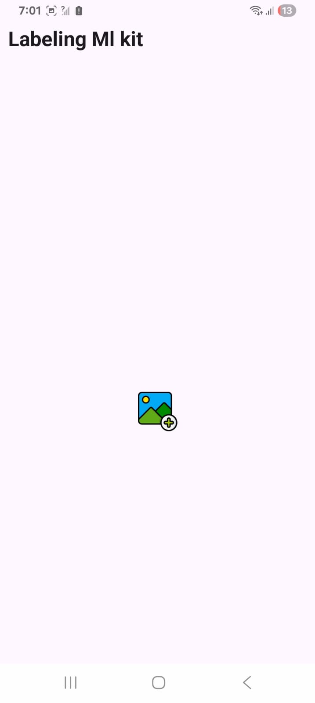

# Manual de Usuario

Esta sección presenta el flujo básico de uso de la aplicación para el etiquetado de objetos con ML Kit en Android.

## 1. Solicitar permisos

La aplicación requiere permisos para cámara, galería y ubicación (opcional).

  

  

---

## 2. Pantalla de inicio

Pantalla inicial con acceso al botón "Empezar".

  

---

## 3. Menú de opciones

Desde aquí se accede a todas las funcionalidades principales.

  

---

## 4. Historial de detecciones

Se puede consultar el historial de imágenes previamente etiquetadas.

  

---

## 5. Etiquetado desde galería

Pantalla donde se selecciona una imagen y se etiqueta con ML Kit.

  

